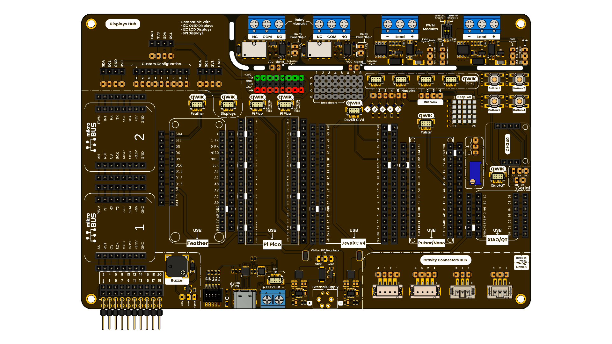

# DevLab: Multi Hub Shield

This is a modular shield expansion board designed to be compatible with various microcontroller platforms, including Pulsar, Xiao, Pi Pico, Feather, Devkit V4, and Mikro Bus. The shield provides a wide range of interfaces and features for prototyping and development, making it an ideal choice for makers, educators, and developers looking to expand their projects with additional connectivity and functionality.

  
  
<em>Development Board</em>

### Quick Links

---

## Overview

| Feature | Description |
|---------|-------------|
| **Support Shield Format** | Pulsar, Xiao, Pi Pico, Feather, Devkit V4, Mikro Bus |
| **Connectivity** | I2C, SPI, UART, GPIO, ADC |
| **LED Matrix** | 5x5 RGB LED matrix for visual feedback |
| **DevLab Ecosystem** | 7 Compatible connectors (JST 1mm) with QWIIC-STEMMA compatibility |
| **Relay Modules** | 2 Relay Modules |
| **Display Hub** | I2C 128x64 OLED Display - Display customization configuration TFT |
| **PWM Interface** | 2 PWM Modules |
| **Potentiometer** | 1 Potentiometer for analog input |
| **Gravity Interface** | 4 Gravity connectors for sensor integration  (2x4 and 2x3 Connectors )|
| **PWM Buzzer** | 1 PWM Buzzer for audio feedback |
| **Expansion Lines** | 4 Breadboard lines for custom circuit connections |
| **Expansion Connectors** | 1 connector with 20 pins for additional modules and shields |
|**Buttons**| 4 Buttons for user input and control |
| **LEDS**| 4 LEDs for status indication and feedback |
| Power Delivery | Supports USB-C, 3.3V, 5V, and external power supply options for versatile power management. |

---

## Applications

- **Prototyping:** Quickly develop and test ideas.
- **Education:** Suitable for learning microcontroller basics.
- **Wearables:** Compact and versatile for wearable devices.
- **Displays:** Use the LED matrix for simple visual output.

## 📝 License

All hardware and documentation in this project are licensed under the **MIT License**.  
See [`LICENSE.md`](LICENSE.md) for details.

  
  Template created by UNIT Electronics

