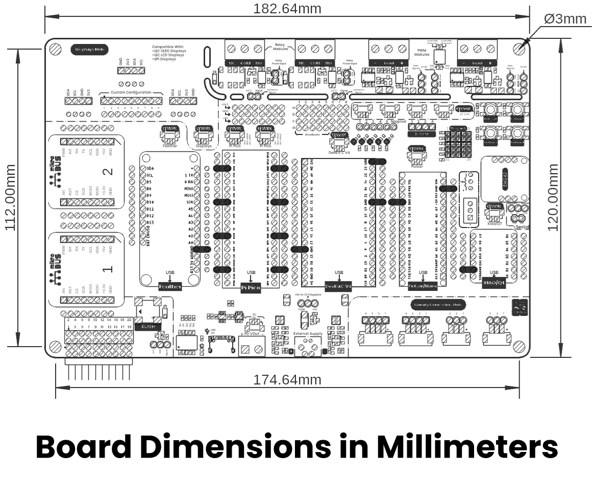
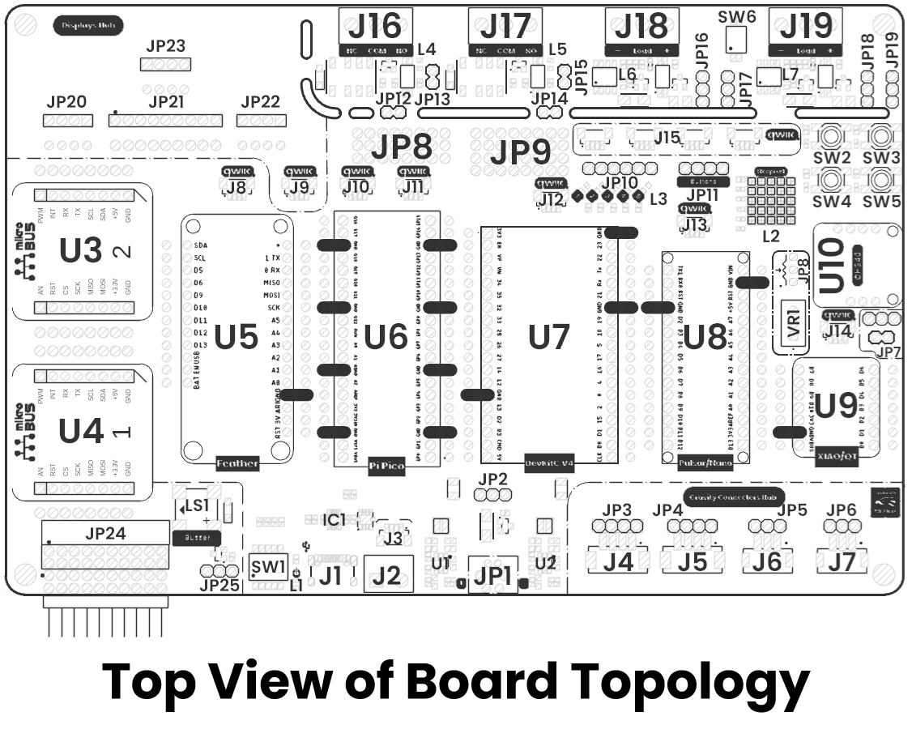

# Hardware

<a href="./unit_sch_v_3_2_0_ue0064_devlab_multihub_shield.pdf"> Schematic</a>

## Pinout

    <a href="#"> Pinout</a>
     
     
     
    

| Pin Label | Function    | Notes                             |
|-----------|-------------|-----------------------------------|
| VCC       | Power Supply| 3.3V or 5V                       |
| GND       | Ground      | Common ground for all components  |

## Dimensions

<a href="./resources/unit_dimension_v_1_0_0_ue0064_devlab_multihub_shield.png">  Dimensions</a>

## Topology

<a href="./resources/unit_topology_v_1_0_0_ue0064_devlab_multihub_shield.png">  Topology</a>
 
 
 

| Ref. | Description |
|------|-------------|
| U3, U4 | mikroBUS™ Shield |
| U5 | Feather Shield |
| U6 | Pi Pico Shield |
| U7 | DevKit V4 Shield |
| U8 | Pulsar Shield (NANO form factor) |
| U9 | XIAO Shield |
| U10 | UNIT CH340E USB-to-Serial Shield |
| SW1 | DIP switch for selecting PD VUSB output (5V, 9V, 12V, 15V, 20V) |
| J1 | USB connector for Power Delivery (PD) input |
| J2 | Terminal block for PD VUSB output (5V, 9V, 12V, 15V, 20V) |
| J3 | QWIIC connector (JST 1.0 mm pitch) for I²C – HUSB238 PD controller |
| J4, J5, J6, J7, JP3, JP4, JP5, JP6 | 2.54 mm JST Gravity-compatible connector hub |
| J8, J9, J10, J11, J12, J13, J14 | QWIIC connectors (JST 1.0 mm pitch) for I²C |
| J15 | QWIIC parallel bus connector (JST 1.0 mm pitch) for I²C |
| JP9, JP24 | Auxiliary 2.54 mm pins for general-purpose use |
| JP20, JP21, JP22, JP23 | Auxiliary connectors for I²C or SPI LCDs/displays |
| SW2, SW3, SW4, SW5, JP11 | General-purpose push buttons |
| JP10 | Signal header for general-purpose LEDs and WS2812B 5x5 matrix (L2) |
| J16, J17 | Terminal blocks for relay outputs |
| J18, J19 | Terminal blocks for PWM module outputs |
| VR1, JP8 | 10k trimpot for ADC applications |
| LS1, JP25 | SMD buzzer for general-purpose use |
| JP8 | Power rail supply (3.3V, 5V, GND) for external devices |

> **Note:** The module also includes a Qwiic/STEMMA QT connector carrying the same four signals (VCC, GND, SDA, SCL) for effortless daisy-chaining.

