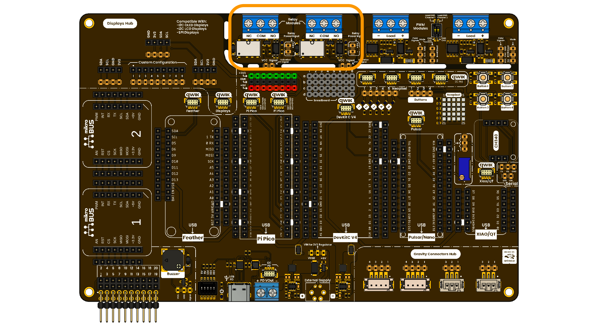

# Chapter 01: Relay Modules

The DevLab Multi Hub Shield includes 2 relay channels for switching external loads.

<div align="center">
  
  <p><em>Development Board</em></p>
</div>

## Platform and programming languages

| Arduino IDE | Thonny IDE | MicroPython
|---------|-------------|-------------|

## Overview

| Properties | Value |
|---------|-------------|
| **Weight** | 3 g |
| **Dimensions** | 38 mm x 20 mm x 2 mm |
| **Module Power Supply** | 3.3 V / 5V |
| **Charging current** | Per Channel: 2 to 15 mA (depending on the logic level) |
| **Connectivity** | GPIO |
| **Indicator** | Power LED |
| **Operating Systems** | Windows, Linux,macOS |


## What It Does

It provides a dedicated 5V supply to power the relay coils, while the logic supply is aligned with the microcontroller's I/O voltage (3.3V or 5V). The module accepts digital control signals to activate the relays, and the relay contacts are designed with normally open (NO) and normally closed (NC) configurations, offering versatile switching options.

## Typical Uses

- Home Automation
- IoT Projects
- Automated Irrigation
- Testing and Laboratory
- Robotics and Mechatronics
- Smart Agriculture
- Security and Alarm Systems
- Education and Demonstrations

## Notes

- This relay module are energized with a control input of **LOW** (0V) signal.
- The expected behavior of the relay module is:
  - Input Signal Low - Relay Coils Energized
  - Input Signal High - Relay Coils Not Energized
  
## Arduino IDE

This program activates and deactivates a single-channel relay every second and prints the current state of the Normally Open (NO) and Normally Closed (NC) contacts to the serial console. As mentioned in the previous section, this relay module uses active-low logic. The relay is energized when the IN pin is low (0 V).

```cpp 
int IN_PIN  = 4;  // Digital pin where the IN pin is connected
int T = 1000;     // Interval in milliseconds

void setup() {
  // Initialize the pin as an output
  pinMode(IN_PIN, OUTPUT);

  // Initialize the Serial port at 9600 baud
  Serial.begin(9600);
  while (!Serial) ;
}

void loop() {
  // --- LOW (Relay ON) ---
  digitalWrite(IN_PIN, LOW);
  Serial.print("NO: On ");
  Serial.println("NC: Off");
  delay(T);

  // --- HIGH (Relay OFF) ---
  digitalWrite(IN_PIN, HIGH);
  Serial.print("NO: Off ");
  Serial.println("NC: On");
  delay(T);
}
``` 

This program activate and deactivate a single-channel relay every second and change the status of the relay depends on what number , we send it trough the serial data 

```cpp 
const int IN_PIN  = 4;                        // Digital pin where the IN pin is connected
const int T = 1000;                           // Interval in milliseconds
bool relayState = HIGH;                       //Turn off by default
unsigned long previousMillis = 0;             
const long interval = 2000;                   // ON/OFF Timer
int cycleCount = 0;                           //Cycle count


void setup() {
  // Initialize the Serial port at 115200 baud
  Serial.begin(115200);
  while (!Serial) ;

  // Initialize the pin as an output
  pinMode(IN_PIN, OUTPUT);

  digitalWrite(IN_PIN,relayState);
  Serial.println("Sistema de Control de Relevador Iniciado...");
  Serial.println("Envíe '1' para encender, '0' para apagar.");

}

void loop() {
  //Encendido por terminal serial
  if (Serial.available() > 0) {
    char command = Serial.read();
    if (command == '1') {
      activateRelay(LOW);
    } else if (command == '0') {
      activateRelay(HIGH);
    }
  }
  /*
  unsigned long currentMillis = millis();
  if (currentMillis - previousMillis >= interval) {
    previousMillis = currentMillis;
    relayState = !relayState;
    activateRelay(relayState);
  }
  */
}

void activateRelay(bool state) {
  digitalWrite(IN_PIN, state);
  if (state == LOW) {
    cycleCount++;
    Serial.print("Relevador ACTIVO. Ciclo nro: ");
    Serial.println(cycleCount);
  } else {
    Serial.println("Relevador INACTIVO.");
  }
}
```
## MicroPython
This program activates and deactivates a single-channel relay every second and prints the current state of the Normally Open (NO) and Normally Closed (NC) contacts to the serial console. As mentioned in the previous section, this relay module uses active-low logic. The relay is energized when the IN pin is low (0 V).

```python
# --------------------------------------------------
# Relay Blink with On/Off Messages
# --------------------------------------------------

import utime
from machine import Pin

# ————— Configuration —————
RELAY_PIN = Pin(14, Pin.OUT)   # GPIO pin for the relay
ON_TIME   = 500               # ON duration in milliseconds
OFF_TIME  = 1500              # OFF duration in milliseconds

# Initialize state
last_tick = utime.ticks_ms()
relay_on  = False
RELAY_PIN.value(1)  # Start with relay OFF (HIGH = OFF for active LOW)

# ————— Main loop (non‑blocking) —————
while True:
    now = utime.ticks_ms()

    if not relay_on and utime.ticks_diff(now, last_tick) >= OFF_TIME:
        relay_on   = True
        last_tick  = now
        RELAY_PIN.value(0)  # LOW = Relay ON (active LOW)
        print("NO: On NC: Off")

    elif relay_on and utime.ticks_diff(now, last_tick) >= ON_TIME:
        relay_on   = False
        last_tick  = now
        RELAY_PIN.value(1)  # HIGH = Relay OFF (active LOW)
        print("NO: Off NC: On")

    # Other tasks can be performed here without blocking

```

```python
# --------------------------------------------------
# Relay Blink with On/Off read from terminal Serial
# --------------------------------------------------

import utime
from machine import Pin

# ————— Configuration —————
RELAY_PIN = Pin(14, Pin.OUT)   # GPIO pin for the relay
ON_TIME   = 1000               # ON duration in milliseconds
OFF_TIME  = 1500               # OFF duration in milliseconds
PREVIOUS_TIME = 0;
# Initialize state
last_tick = utime.ticks_ms()
relay_on  = False
RELAY_PIN.value(1)  # Start with relay OFF (HIGH = OFF for active LOW)

# ————— Main loop (non‑blocking) —————
while True:
    now = utime.ticks_ms()

    # Comprobamos si hay caracteres esperando en el buffer de entrada
    res = select.select([sys.stdin], [], [], 0)
    
    if res[0]:
        # Leemos un carácter de la consola
        char = sys.stdin.read(1)
        print(f"Recibiste: {char}")
    if not relay_on and utime.ticks_diff(now, last_tick) >= OFF_TIME:
        relay_on   = True
        last_tick  = now
        RELAY_PIN.value(0)  # LOW = Relay ON (active LOW)
        print("NO: On NC: Off")

    elif relay_on and utime.ticks_diff(now, last_tick) >= ON_TIME:
        relay_on   = False
        last_tick  = now
        RELAY_PIN.value(1)  # HIGH = Relay OFF (active LOW)
        print("NO: Off NC: On")


    


```