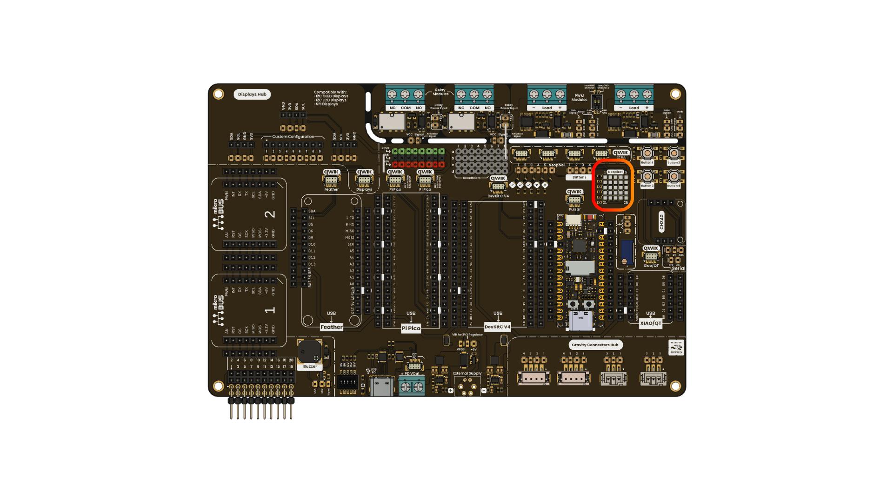
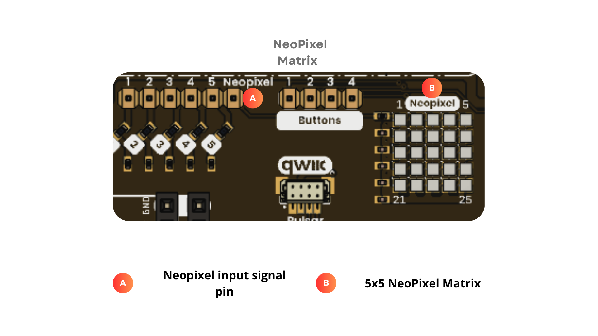
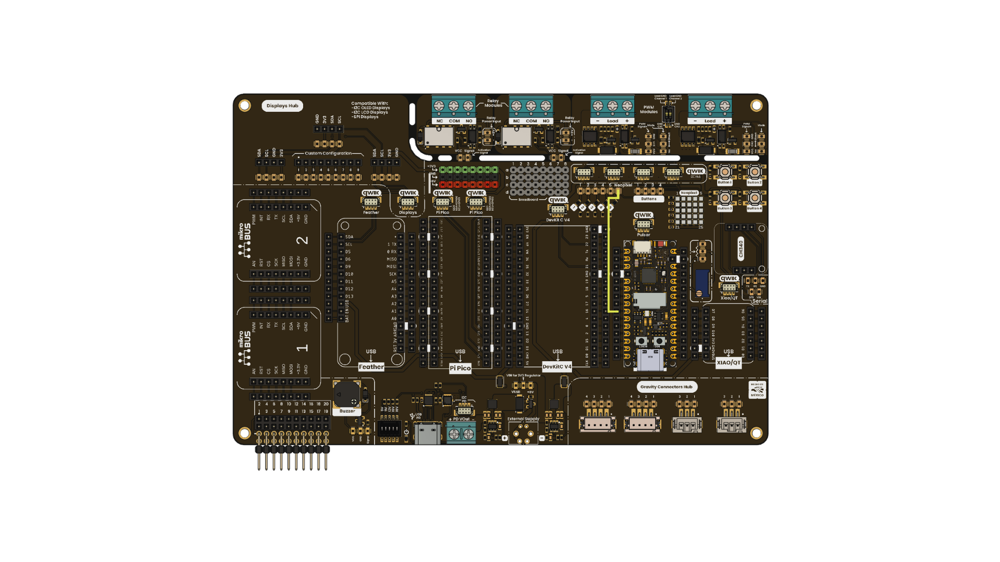

# Chapter 03: NeoPixel

<div align="center">
  
  <p><em>Development Board</em></p>
</div>

# Introduction

The NeoPixel matrix included in your UNIT DevLab: Multi Hub Shield features 25 addressable LEDs, perfect for creating visual effects, animations, and various other applications. These are RGB LEDs that can be individually controlled via serial communication in a daisy-chain configuration, simplifying the wiring and control of multiple units.

# Key Technical Specifications

<div align="center">

| **Parameter**   |            **Description**                                       | **Min** |       **Max**      | **Unit** |
|:---------------:|:----------------------------------------------------------------:|:-------:|:------------------:|:--------:|
|      $V_{DD}$   | Operation Voltage                                                |   3.3   |   5.5              |    V     |
| $V_{IN}$     | Input Logic Voltage                           |    -0.5   |   -                |    $V_{DD}$ + 0.5 V     |


</div>

# Pinout

<div align="center">
  
  <p><em>Pinout Relay Module</em></p>

<br/>

</div>

# Characteristics

- 25 Addressable LEDs: Features a 5x5 matrix of 25 smart LEDs, each with a unique address. This allows for independent software control of brightness and color for every individual LED.

- Single-Pin Control (Data Bus): Utilizing the serial protocol powered by NeoPixel technology, the entire matrix can be controlled using just one digital pin on the microcontroller, optimizing hardware resource usage.

- 24-Bit RGB Color Gamut: Each LED can produce up to 16.7 million colors by mixing its three internal channels (Red, Green, and Blue), each offering 256 levels of intensity.

- Daisy-Chain Architecture: The design allows the data signal to flow sequentially from one LED to the next, making it easy to create visual effects, animations, or scrolling text.


# Use Examples 

## Connections
The image illustrates the required connections, which only need a single digital pin acting as a user-configurable digital output, and its nedeed to be connected in the last connector with the label of Neopixel in your shield, because is the pin with assign of the data in pin for work with the neopixel matrix.

<div align="center">
  
  <p><em>Pin Connections</em></p>
</div>

## Example Code
Load the example code in your board .
```cpp 
/** @file neopixels.ino
* @brief UNIT Devlab Multi Hub Shield – Modulo NeoPixel
*
* Este modulo implementa el uso basico de pines digitales 
* para el uso y funcionamiento de la matriz neopixel de tu 
* Multi Hub Shield con animaciones predefinidas en la biblioteca animations
*
*
* @author UNIT Electronics
*
*
*/
#include "animations.h"


#define DELAYVAL   50
void setup() {
    setupAnimSetting(pixels);
}


void loop() {

    delay(500);
    //colorWipe(pixels, pixels.Color(255, 0, 0), DELAYVAL );
    //confetti(pixels,30);
    //theaterChase(pixels,pixels.Color(127,127,127),DELAYVAL);
    quetzalcoatlEffect(pixels,60);
    delay(500);
    pixels.clear();
    pixels.show();
    delay(1000);
}
``` 
