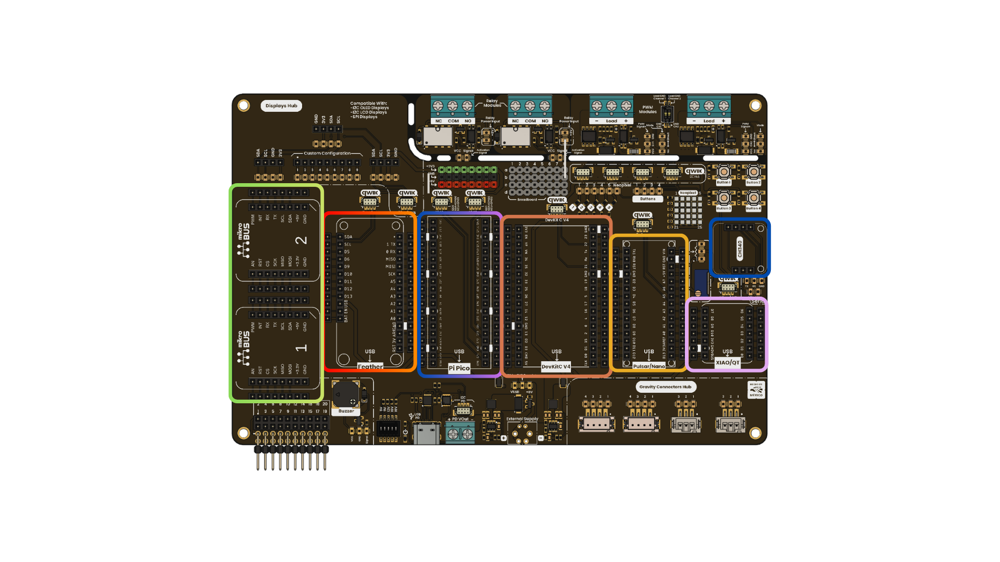
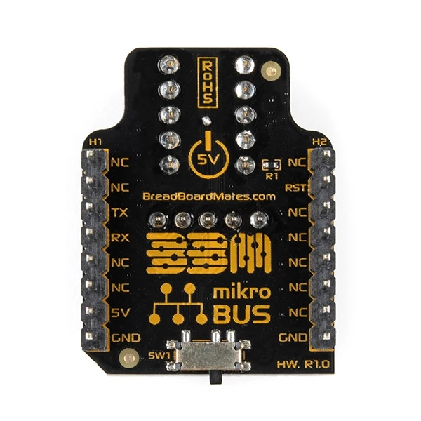
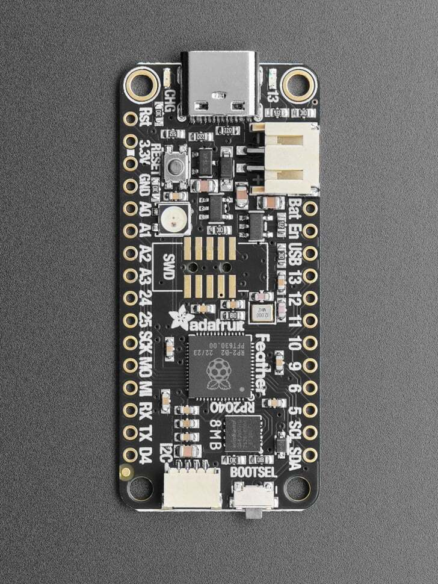
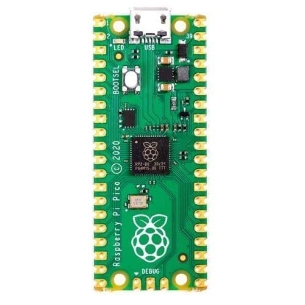
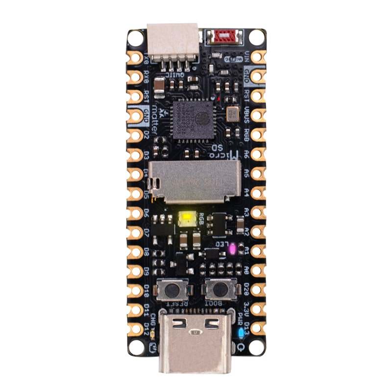
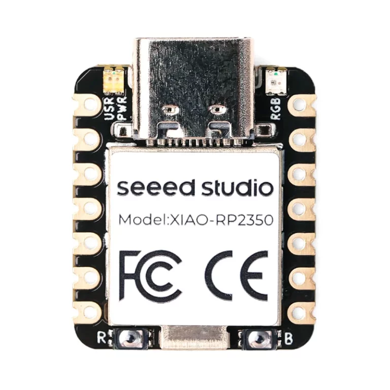
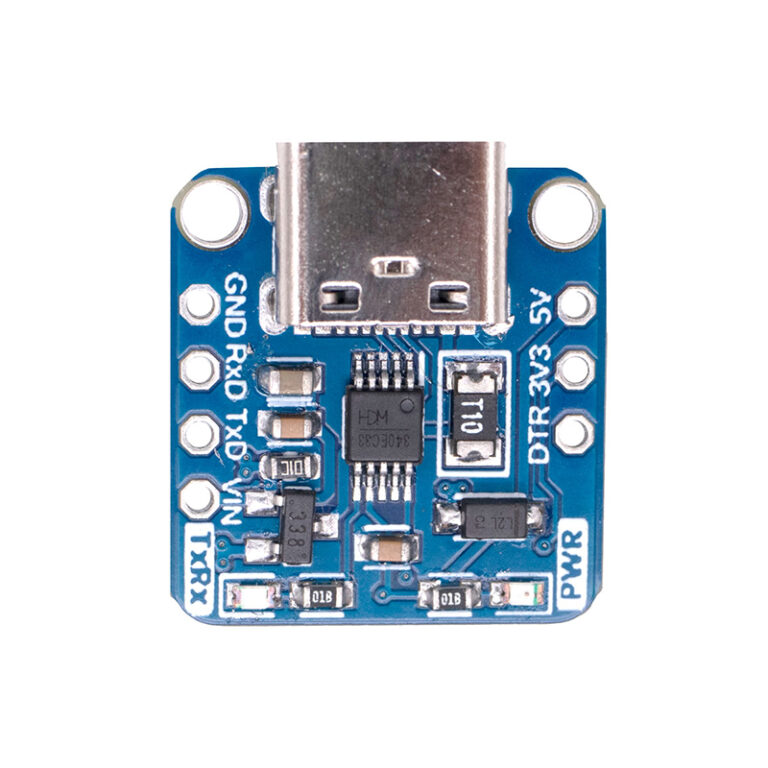
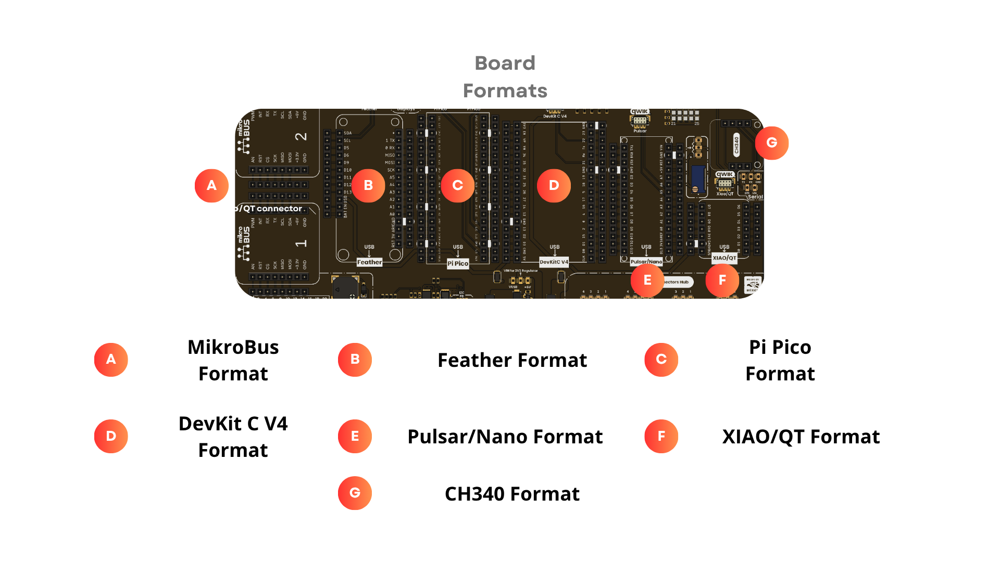

# Chapter 04: Board Assignment

  
  
<em>Development Board</em>

# Introduction
The UNIT DevLab: MultiHub Shield features 7 sockets designed for programming and experimentation. This versatile shield supports a wide range of development boards, allowing seamless integration with both the UNIT Electronics ecosystem and third-party modules.

# Compatibility Zones

## MikroBus format
- Description: This socket supports the standard dimensions and pinout for mikroBUS format.

- Pin Count: 16 pins total.

- Compatibility: Designed for seamless integration of any development board following the mikroBUS standard.

  
  
<em>Development Board</em>

## Feather format
- Description: This socket supports the standard dimensions and pinout for Feather Adafruit format

- Pin Count: 25 pins total.

- Compatibility: Supports a diverse range of Feather-based boards, including ESP32 and specialized controllers.

  
  
<em>Development Board</em>

## Pi Pico format

- Description: This socket supports the standard dimensions and pinout for Raspberry Pi Pico 1 and 2 boards.

- Pin Count: 40 pins total.

- Compatibility: Designed for seamless integration of any development board following the Pi Pico footprint.

  
  
<em>Development Board</em>

## Devkit C V4 format

- Description: This socket supports the standard dimensions and pinout for ESP32 Devkit C V4.

- Pin Count: 36 pins total.

- Compatibility: Designed for seamless integration of any development board following the ESP32 DEVKIT C V4

  
  
<em>Development Board</em>

## Zone 6: Pulsar/Nano format

- Description: This socket supports the standard dimensions and pinout for UNIT Electronics Nano boards, like the UNIT Pulsar ESP32-C6

- Pin Count: 30 pins total.

- Compatibility: Designed for seamless integration of any development board following the Nano boards footprint.

  
  
<em>Development Board</em>

## Zone 7: XIAO/QT format

- Description: This socket supports the standard dimensions and pinout for XIAO/QT format.

- Pin Count: 14 pins total.

- Compatibility: Designed for seamless integration of any development board following the XIAO footprint.

  
  
<em>Development Board</em>

## Zone 8: UNIT CH340E format and breakout

- Description: This socket supports the standard dimensions and pinout for modules USB to TTL serial, like the UNIT CH340E.

- Pin Count: 7 pins total.

- Compatibility: Designed for seamless integration of any development board following the CH340E module footprint.

  
  
<em>Development Board</em>

# Pinout

  
  
<em>Development Board</em>

