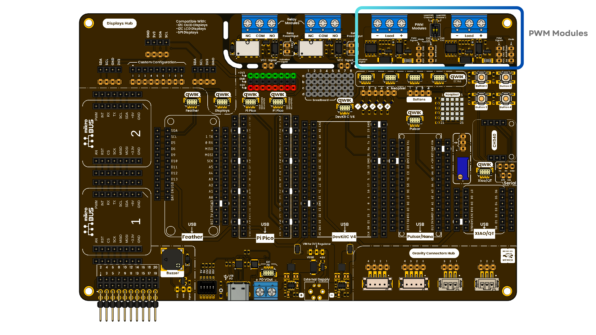
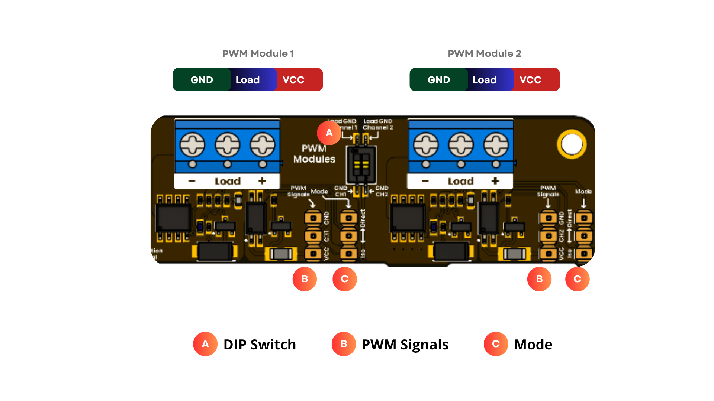
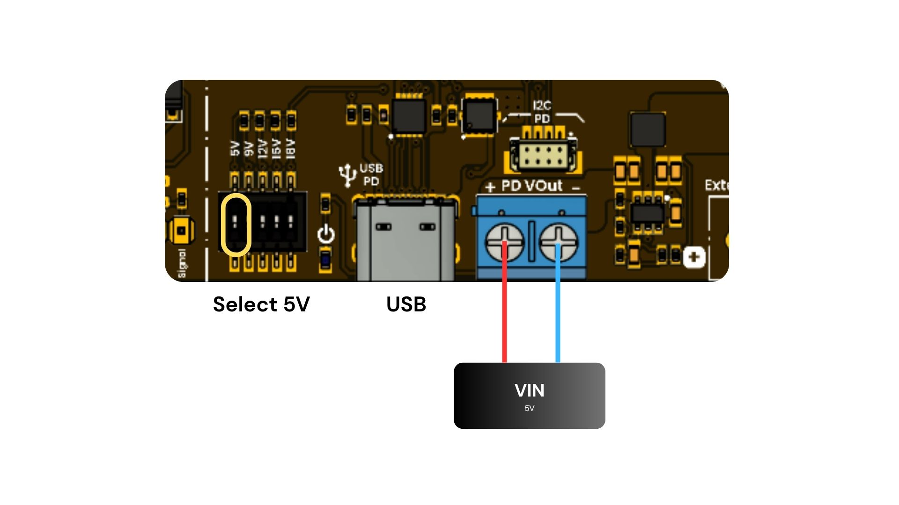
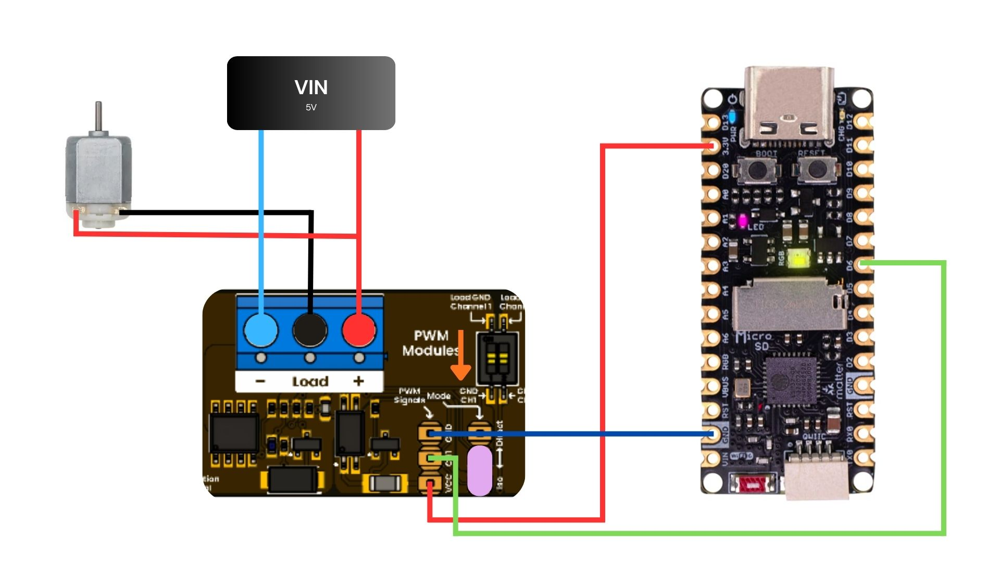

# Chapter 05: PWM Modules

<div align="center">
  
  <p><em>Development Board</em></p>
</div>

# Introduction

The 2-channel AO4410 PWM module enables reliable switching of external loads at voltages and currents higher than the microcontroller can natively handle; it is ideal for motor speed control, high-power LED dimming, and other projects requiring precise power regulation via PWM.

</br>

# Key Technical Specifications

<div align="center">

| **Parameter** |            **Description**            | **Min** | **Max** | **Unit** |
|:-------------:|:-------------------------------------:|:-------:|:-------:|:--------:|
|      Vin      | Input voltage to power on the module  |   3.3   |    5    |    V     |
|    V Load*    | Maximum voltage for the external load |    -    |   30    |    V     |
|    I Load*    | Maximum current for the external load |    -    |   15    |    A     |
|      P*       |         Maximum power at load         |    -    |   200   |    W     |

</div>

* A DIP switch is provided to couple or isolate the microcontroller ground from the load ground.
* Mode selection**: use jumper bridges to choose "Direct mode" (grounds coupled) or "Isolated mode" (grounds isolated) for improved protection.

***These values were tested at 1 kHz. Performance may vary at other frequencies.**

****Use the jumper bridges and the DIP switch to change between Direct and Isolated modes.**

# Pinout

<div align="center">
  
  <p><em>Pinout PWM Modules</em></p>

<br/>

</div>

# Characteristics

- 2-channel PWM : Two independent channels for versatile control.
- 5V and 3.3V Logic : Compatible with 3.3V and 5V microcontrollers.
- External loads : Allows you to power external devices up to 200W.
- Mode selection : Uses "direct PWM" or an isolated mode using an optocoupler.
- Isolated grounds : Connects or isolates grounds using a DIP switch.

# Safety Considerations

- Ensure that the power supply has the correct voltage and current
- Use wire gauge appropriate for the load current
- Check load compatibility before connecting
- Do not exceed the maximum module specifications
- Ensure adequate heat dissipation in high-power applications

# USB PD

To power the circuit, connect a USB-PD power adapter to the USB port. This allows different output voltage levels to be obtained depending on the DIP switch configuration. For this practice, only 5 V will be used, which will be available at the output terminal block.

<div align="center">
  
  <p><em>USB Power delivery</em></p>

<br/>

</div>

# Arduino IDE

The following code is intended to control the PWM signal in an ascending and descending manner to vary the voltage applied to the motor.

- Make sure to set the PWM module DIP switch to the low state to isolate the microcontroller from the load. In the connection diagram, the correct switch direction is indicated by an orange arrow.

- Place a jumper bridge to select the isolated mode. In the connection diagram, the jumper position is represented by a pink circle.

<br/>

<div align="center">
  
  <p><em>Connection</em></p>

<br/>

</div>

```cpp
// PWM duty print on Serial Monitor

int PWM_IN1 = 20;   // PWM pin 1
int STEP = 5;       //Indicador led de la Pulsar C6
void setup() {
  Serial.begin(115200);  
  Serial.println("Serial inicializado..."); 
  delay(200);           

  pinMode(PWM_IN1, OUTPUT);  // Salida de PWM

  Serial.println("Starting fade...");
}

void loop() {
  // Fade up
  for (int duty = 0; duty <= 255; duty += STEP) {
    analogWrite(PWM_IN1, duty);
    Serial.print("Duty: ");
    Serial.println(duty);
    delay(100);
  }

  // Fade down
  for (int duty = 255; duty >= 0; duty -= STEP) {
    analogWrite(PWM_IN1, duty);
    Serial.print("Duty: ");
    Serial.println(duty);
    delay(100);
  }
}
```