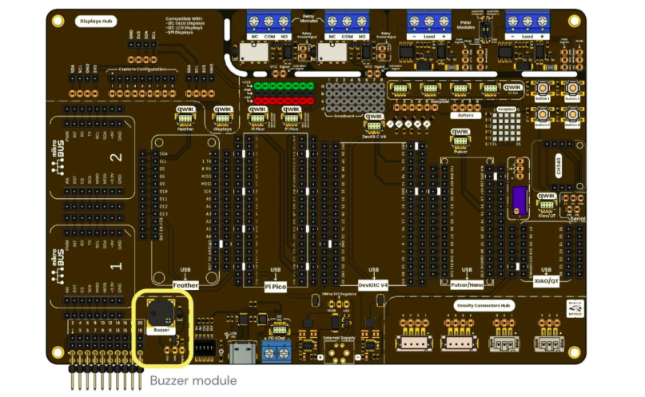
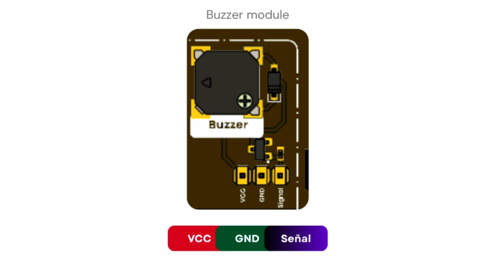
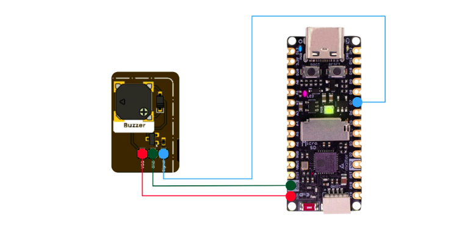

# Chapter 6: Buzzer Module

<div align="center">
  
  <p><em>Development Board</em></p>
</div>

## Introduction

A **passive buzzer** is a component capable of producing sound when it receives an oscillating electrical signal. Unlike an **active buzzer**, a passive buzzer does not generate a fixed sound by itself; instead, it requires the microcontroller to send a signal at a specific frequency.

This allows different musical tones to be reproduced, since each musical note is related to a specific frequency. For example, the note **A4** corresponds approximately to **440 Hz**. By changing the frequency sent to the buzzer, a sequence of notes can be generated to create a melody.

In this practice, the `tone()` function will be used to generate sounds with a passive buzzer. The objective is to understand how a song can be represented using a list of notes and durations, so the user can create their own melodies.

This is useful for alarm systems, health monitoring devices, access control systems, automotive panels, irrigation systems with failure alerts, and alert systems for drones or autonomous robots.

---

## Previous Knowledge

Before creating a melody, it is important to understand three main concepts:

---

## 1. Frequency

**Frequency** indicates how many times a signal repeats in one second. It is measured in Hertz, abbreviated as **Hz**.

In sound, frequency determines whether a tone is low-pitched or high-pitched.

| Frequency | Type of sound |
|---|---|
| Low frequency | Low-pitched sound |
| High frequency | High-pitched sound |

For example:

```cpp
tone(buzzer, 262);
```

generates a lower-pitched sound than:

```cpp
tone(buzzer, 1047);
```

because `262 Hz` is a lower frequency than `1047 Hz`.

---

## 2. Musical Note

A musical note can be represented by a frequency. In programming, to apply **clean code** principles, names such as `NOTE_C4`, `NOTE_D4`, `NOTE_E4`, etc., are commonly used.

For example:

```cpp
#define NOTE_C4 262
#define NOTE_D4 294
#define NOTE_E4 330
#define NOTE_F4 349
#define NOTE_G4 392
#define NOTE_A4 440
#define NOTE_B4 494
```

This means that each name represents a frequency.

| Note | Code notation | Approximate frequency |
|---|---|---:|
| C | `NOTE_C4` | 262 Hz |
| D | `NOTE_D4` | 294 Hz |
| E | `NOTE_E4` | 330 Hz |
| F | `NOTE_F4` | 349 Hz |
| G | `NOTE_G4` | 392 Hz |
| A | `NOTE_A4` | 440 Hz |
| B | `NOTE_B4` | 494 Hz |

The letter used in the note name comes from the Anglo-Saxon musical notation system:

| Latin notation | Code notation |
|---|---|
| Do | C |
| Re | D |
| Mi | E |
| Fa | F |
| Sol | G |
| La | A |
| Si | B |

For example, `NOTE_C4` means **C in octave 4**.

The following table shows the musical notes, their code notation, and their corresponding frequency:

| Latin notation | Code notation | Frequency |
|---|---|---:|
| B0 | `NOTE_B0` | 31 Hz |
| C1 | `NOTE_C1` | 33 Hz |
| C#1 / C sharp 1 | `NOTE_CS1` | 35 Hz |
| D1 | `NOTE_D1` | 37 Hz |
| D#1 / D sharp 1 | `NOTE_DS1` | 39 Hz |
| E1 | `NOTE_E1` | 41 Hz |
| F1 | `NOTE_F1` | 44 Hz |
| F#1 / F sharp 1 | `NOTE_FS1` | 46 Hz |
| G1 | `NOTE_G1` | 49 Hz |
| G#1 / G sharp 1 | `NOTE_GS1` | 52 Hz |
| A1 | `NOTE_A1` | 55 Hz |
| A#1 / A sharp 1 | `NOTE_AS1` | 58 Hz |
| B1 | `NOTE_B1` | 62 Hz |
| C2 | `NOTE_C2` | 65 Hz |
| C#2 / C sharp 2 | `NOTE_CS2` | 69 Hz |
| D2 | `NOTE_D2` | 73 Hz |
| D#2 / D sharp 2 | `NOTE_DS2` | 78 Hz |
| E2 | `NOTE_E2` | 82 Hz |
| F2 | `NOTE_F2` | 87 Hz |
| F#2 / F sharp 2 | `NOTE_FS2` | 93 Hz |
| G2 | `NOTE_G2` | 98 Hz |
| G#2 / G sharp 2 | `NOTE_GS2` | 104 Hz |
| A2 | `NOTE_A2` | 110 Hz |
| A#2 / A sharp 2 | `NOTE_AS2` | 117 Hz |
| B2 | `NOTE_B2` | 123 Hz |
| C3 | `NOTE_C3` | 131 Hz |
| C#3 / C sharp 3 | `NOTE_CS3` | 139 Hz |
| D3 | `NOTE_D3` | 147 Hz |
| D#3 / D sharp 3 | `NOTE_DS3` | 156 Hz |
| E3 | `NOTE_E3` | 165 Hz |
| F3 | `NOTE_F3` | 175 Hz |
| F#3 / F sharp 3 | `NOTE_FS3` | 185 Hz |
| G3 | `NOTE_G3` | 196 Hz |
| G#3 / G sharp 3 | `NOTE_GS3` | 208 Hz |
| A3 | `NOTE_A3` | 220 Hz |
| A#3 / A sharp 3 | `NOTE_AS3` | 233 Hz |
| B3 | `NOTE_B3` | 247 Hz |
| C4 | `NOTE_C4` | 262 Hz |
| C#4 / C sharp 4 | `NOTE_CS4` | 277 Hz |
| D4 | `NOTE_D4` | 294 Hz |
| D#4 / D sharp 4 | `NOTE_DS4` | 311 Hz |
| E4 | `NOTE_E4` | 330 Hz |
| F4 | `NOTE_F4` | 349 Hz |
| F#4 / F sharp 4 | `NOTE_FS4` | 370 Hz |
| G4 | `NOTE_G4` | 392 Hz |
| G#4 / G sharp 4 | `NOTE_GS4` | 415 Hz |
| A4 | `NOTE_A4` | 440 Hz |
| A#4 / A sharp 4 | `NOTE_AS4` | 466 Hz |
| B4 | `NOTE_B4` | 494 Hz |
| C5 | `NOTE_C5` | 523 Hz |
| C#5 / C sharp 5 | `NOTE_CS5` | 554 Hz |
| D5 | `NOTE_D5` | 587 Hz |
| D#5 / D sharp 5 | `NOTE_DS5` | 622 Hz |
| E5 | `NOTE_E5` | 659 Hz |
| F5 | `NOTE_F5` | 698 Hz |
| F#5 / F sharp 5 | `NOTE_FS5` | 740 Hz |
| G5 | `NOTE_G5` | 784 Hz |
| G#5 / G sharp 5 | `NOTE_GS5` | 831 Hz |
| A5 | `NOTE_A5` | 880 Hz |
| A#5 / A sharp 5 | `NOTE_AS5` | 932 Hz |
| B5 | `NOTE_B5` | 988 Hz |
| C6 | `NOTE_C6` | 1047 Hz |
| C#6 / C sharp 6 | `NOTE_CS6` | 1109 Hz |
| D6 | `NOTE_D6` | 1175 Hz |
| D#6 / D sharp 6 | `NOTE_DS6` | 1245 Hz |
| E6 | `NOTE_E6` | 1319 Hz |
| F6 | `NOTE_F6` | 1397 Hz |
| F#6 / F sharp 6 | `NOTE_FS6` | 1480 Hz |
| G6 | `NOTE_G6` | 1568 Hz |
| G#6 / G sharp 6 | `NOTE_GS6` | 1661 Hz |
| A6 | `NOTE_A6` | 1760 Hz |
| A#6 / A sharp 6 | `NOTE_AS6` | 1865 Hz |
| B6 | `NOTE_B6` | 1976 Hz |
| C7 | `NOTE_C7` | 2093 Hz |
| C#7 / C sharp 7 | `NOTE_CS7` | 2217 Hz |
| D7 | `NOTE_D7` | 2349 Hz |
| D#7 / D sharp 7 | `NOTE_DS7` | 2489 Hz |
| E7 | `NOTE_E7` | 2637 Hz |
| F7 | `NOTE_F7` | 2794 Hz |
| F#7 / F sharp 7 | `NOTE_FS7` | 2960 Hz |
| G7 | `NOTE_G7` | 3136 Hz |
| G#7 / G sharp 7 | `NOTE_GS7` | 3322 Hz |
| A7 | `NOTE_A7` | 3520 Hz |
| A#7 / A sharp 7 | `NOTE_AS7` | 3729 Hz |
| B7 | `NOTE_B7` | 3951 Hz |
| C8 | `NOTE_C8` | 4186 Hz |
| C#8 / C sharp 8 | `NOTE_CS8` | 4435 Hz |
| D8 | `NOTE_D8` | 4699 Hz |
| D#8 / D sharp 8 | `NOTE_DS8` | 4978 Hz |

---

## 3. Duration of a Note

Besides knowing which note should sound, it is also necessary to know **how long the note should sound**.

In the code, durations can be represented using numbers such as:

```cpp
4, 8, 16
```

They are usually interpreted as follows:

| Value | Approximate interpretation | Duration if the base is 1000 ms |
|---:|---|---:|
| `1` | Very long note | 1000 ms |
| `2` | Half duration | 500 ms |
| `4` | Normal note | 250 ms |
| `8` | Short note | 125 ms |
| `16` | Very short note | 62 ms |

In the example code, the duration is calculated as follows:

```cpp
noteDuration = 1000 / value;
```

Or mathematically:

```text
Duration = 1000 / value
```

---

## `tone()` Function

The main function used to generate sound with a passive buzzer is:

```cpp
tone(pin, frequency, duration);
```

This function generates a square wave on a microcontroller pin. That signal makes the buzzer vibrate and produce sound.

| Argument | Meaning |
|---|---|
| `pin` | Pin where the buzzer is connected |
| `frequency` | Sound frequency in Hz |
| `duration` | Time the sound will last in milliseconds |

---

## Technical Specifications

| Parameter | Description | Min | Max | Unit |
|---|---|---:|---:|---|
| VCC | Module power supply | 3.3 | 5 | V |
| I | Current demand | 5 | 30 | mA |
| F | Operating frequency | - | 5,000 | Hz |
| Resonant frequency | Frequency where the buzzer works with greater acoustic efficiency | - | 2,700 | Hz |
| Sound level | Minimum sound intensity generated by the buzzer | 80 | - | dB at 10 cm |
| Operating temperature | Allowed temperature range during operation | -20 | 70 | °C |

---

## Usage Considerations

1. Depending on the note frequency and operating conditions, the buzzer may demand more current than a microcontroller pin can safely supply. To avoid damaging the microcontroller, the module includes a MOSFET that works as a switching stage. This allows the buzzer to be powered from the module power supply while the microcontroller only sends the control signal.

2. Do not power the module with a voltage higher than **5 V**, as this may damage the buzzer or the module components.

3. Do not use frequencies higher than the maximum frequency supported by the component.

4. Work near the resonant frequency to obtain **higher sound intensity**. Near this frequency, the buzzer usually produces a louder and more efficient sound.

5. Consider that the **80 dB sound level depends on the test conditions**. The minimum level of **80 dB measured at 10 cm** was obtained using a **2700 Hz square wave**, with **50% duty cycle** and **5 VCC**. If any of these conditions change, the perceived volume may vary.

---

## Pinout

<div align="center">
  
  <p><em>Development Board</em></p>
</div>

---

## Features

- **80 dB sound level at 10 cm:** allows audible alerts to be generated in signaling, notification, or acoustic feedback applications.
- **5 V and 3.3 V logic:** compatible with microcontrollers that operate with 3.3 V and 5 V logic levels.

---

## Example Practice

### Materials

1. UNIT Pulsar C6
2. Buzzer module
3. Male-to-female jumper wires

---

## Connections

<div align="center">
  
  <p><em>Connections</em></p>
</div>

---

## Example Code

```cpp
// The following example is based on the design from the Hardware Hacking practice. Visit the link for more information. Use this example ay tour own risk. 
// https://hardwarehackingmx.wordpress.com/2013/07/03/leccion-11-arduino-tocando-la-clasica-melodia-de-mario-bros/

#define NOTE_E6  1319
#define NOTE_G6  1568
#define NOTE_A6  1760
#define NOTE_AS6 1865
#define NOTE_B6  1976
#define NOTE_C7  2093
#define NOTE_D7  2349
#define NOTE_E7  2637
#define NOTE_F7  2794
#define NOTE_G7  3136
#define NOTE_A7  3520


#define REST 0

int buzzer = 21;

int melody[] = {
  NOTE_E7, NOTE_E7, REST, NOTE_E7,
  REST, NOTE_C7, NOTE_E7, REST,
  NOTE_G7, REST, REST, REST,
  NOTE_G6, REST, REST, REST,

  NOTE_C7, REST, REST, NOTE_G6,
  REST, REST, NOTE_E6, REST,
  REST, NOTE_A6, REST, NOTE_B6,
  REST, NOTE_AS6, NOTE_A6, REST,

  NOTE_G6, NOTE_E7, NOTE_G7,
  NOTE_A7, REST, NOTE_F7, NOTE_G7,
  REST, NOTE_E7, REST, NOTE_C7,
  NOTE_D7, NOTE_B6, REST, REST
};

int durations[] = {
  12, 12, 12, 12,
  12, 12, 12, 12,
  12, 12, 12, 12,
  12, 12, 12, 12,

  12, 12, 12, 12,
  12, 12, 12, 12,
  12, 12, 12, 12,
  12, 12, 12, 12,

  9, 9, 9, 12,
  12, 12, 12, 12,
  12, 12, 12, 12,
  12, 12, 12, 12
};

void setup() {
 // Nada que configurar
}

void loop() {
  for (int thisNote = 0; thisNote < sizeof(melody)/sizeof(int); thisNote++) {
    int noteDuration = 1000 / durations[thisNote];
    if (melody[thisNote] != REST) {
      tone(buzzer, melody[thisNote], noteDuration);
    }
    delay(noteDuration * 1.30);
    noTone(buzzer);
  }

  delay(2000);  // Pausa antes de repetir
}
```

---

## Conclusions

The `tone()` function allows sounds to be generated using a passive buzzer through specific frequencies. By relating each frequency to a musical note, it is possible to build simple melodies from a microcontroller.

The most important concept is that a song can be represented as a sequence of notes and durations. The notes define which sound is reproduced, while the durations determine how long each note remains active. With this logic, the user can modify existing songs or create their own melodies in a simple way.