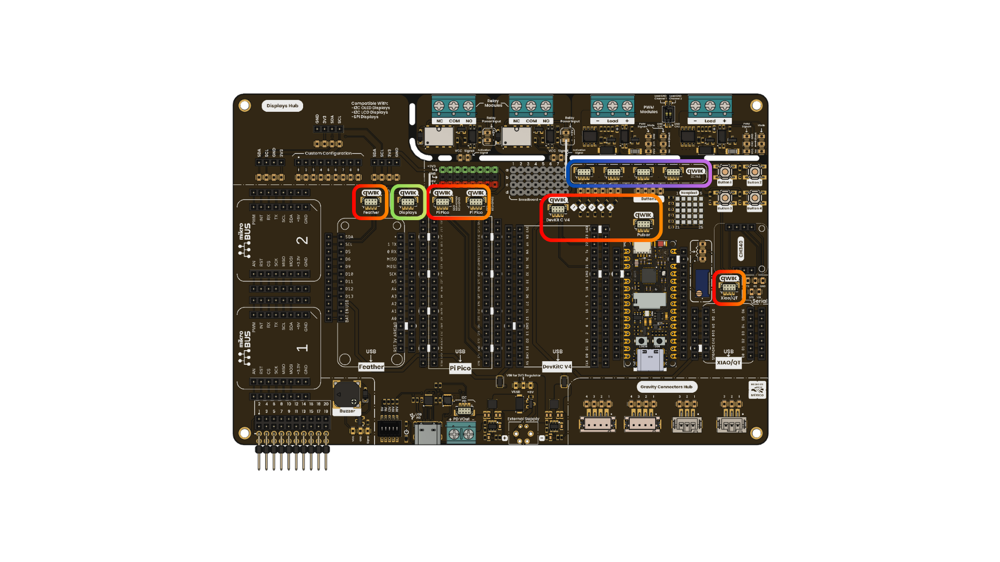
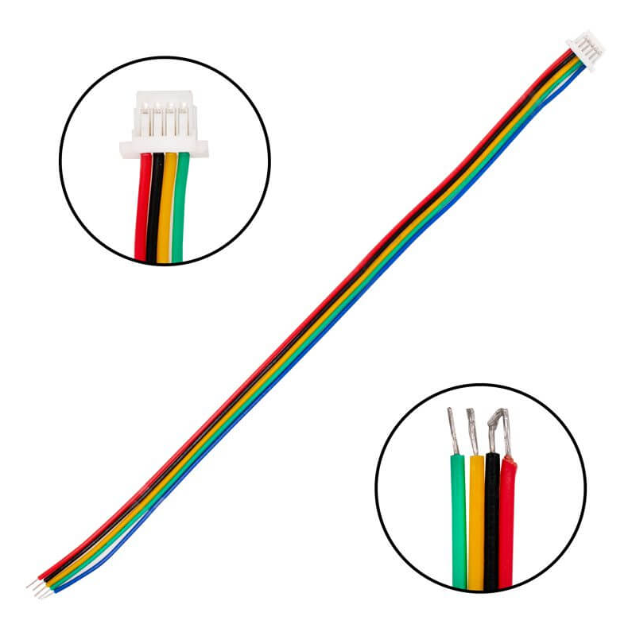
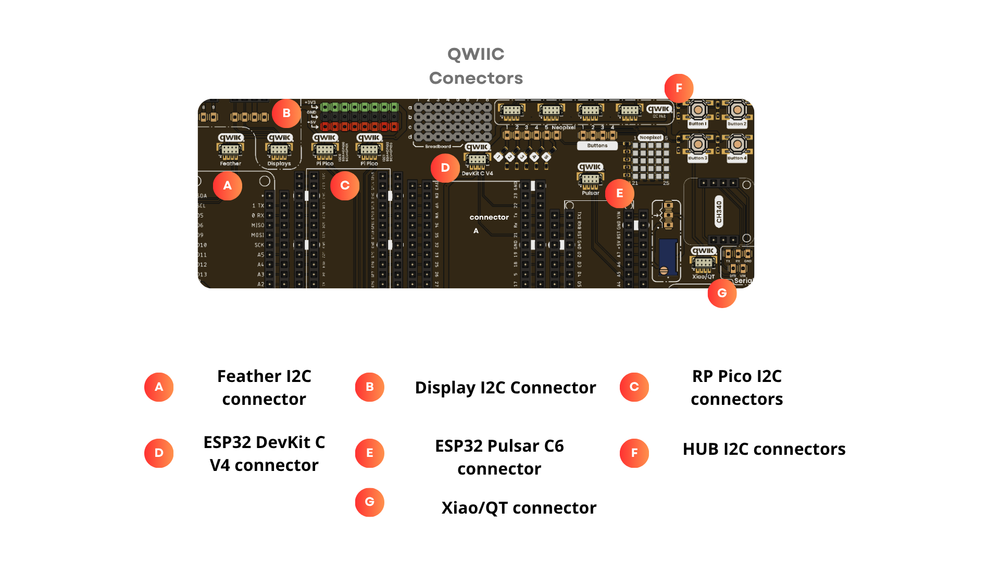
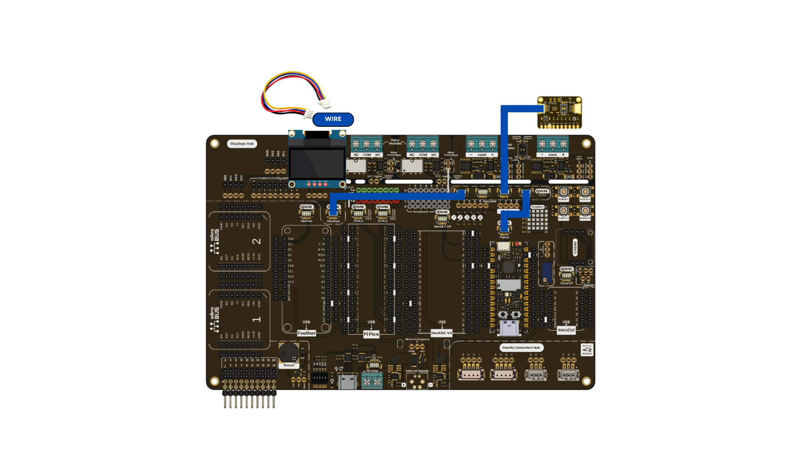

# Chapter 07: QWIIC / DevLab

<div align="center">
  
  <p><em>Development Board</em></p>
</div>

# Introduction

In this lesson, you will learn how to use the Qwiic connectors included in your UNIT DevLab Multihub Shield. These connectors allow you to expand the I2C protocol through a "plug-and-play" system, making them compatible with the UNIT DevLab ecosystem and any sensor or device using 1mm JST connectors. By using these, you can easily connect sensors and displays while reducing manual wiring. Their strategic distribution across the board enables efficient design and easy scaling.

SparkFun's Qwiic Connect System uses 4-pin JST connectors to quickly interface development boards with sensors, LCDs, relays, and more. In short, Qwiic is a four-pin plug-and-receptacle system that adds an I2C interface to almost any project.

# Key Technical Specifications

All UNIT development boards are Qwiic-compliant, featuring 4-pin JST SH 1.0mm connectors to easily integrate sensors, actuators, and other peripherals.
<div align="center">


| Pin | Color | 
| --- | --- |
| SCL | Yellow |
| SDA | Green |
| 3.3 V | Red |
| GND | Black |

</div>
<div align="center">
  
  <p><em>Connector Colors</em></p>
</div>

# UNIT Safety considerations

- Be careful with the wires in your connector; make sure the colors are correctly aligned.
- Verify for your code the pinout for the specific microcontroller of our UNIT Family, like the table listed under.

| **Tarjeta** | **SCL** | **SDA** |
| --- | --- | --- |
| Dual MCU One RP2040 | 5 | 4 |
| Dual MCU One ESP32 | 22 | 21 |
| Dual MCU RP2040 | 13 | 12 |
| Dual MCU ESP32 | 22 | 21 |
| UNIT Pulsar ESP32-C6 | 7 | 6 |
| UNIT TouchDot S3 | 6 | 5 |
| UNIT Pulsar H2 | 22 | 12 |

# External Boards Safety Considerations
- Verify the specific pin for the external brands boards , for code and connect the right wires to your shield.

| **Tarjeta** | **SCL** | **SDA** |
| --- | --- | --- |
| ESP32 DevKitC V4 | 22 | 21 |
| Feather | 11 | 12 |
| Raspberry Pi Pico I2C0 | 2 | 1 |
| Raspberry Pi Pico I2C1 | 5 | 4 |
| Nano Board Format| 9 | 8 |
| XIAO | D5 | D4 |

# Pinout

<div align="center">
  
  <p><em>Pinout Relay Module</em></p>

<br/>

</div>

# Use Examples 

## Connections
<div align="center">
  
  <p><em>Pinout Relay Module</em></p>

<br/>

</div>

## Example Code
```cpp 
#include <Wire.h>
#include <Adafruit_SSD1306.h>
#include "BMA250.h"

#define SDA_PIN 6
#define SCL_PIN 7

#define SCREEN_WIDTH 128
#define SCREEN_HEIGHT 64
#define OLED_RESET -1

// Accelerometer sensor variables
UBMA250 accel_sensor;
int x, y, z;
double temp;

Adafruit_SSD1306 display(SCREEN_WIDTH, SCREEN_HEIGHT, &Wire, OLED_RESET);

void setup() {
  Serial.begin(115200);
  
  // Configure I²C pins
  Wire.setSDA(SDA_PIN);
  Wire.setSCL(SCL_PIN);
  Wire.begin();
  
  Serial.print("I2C initialized with SDA=");
  Serial.print(SDA_PIN);
  Serial.print(", SCL=");
  Serial.println(SCL_PIN);
  Serial.println("OLED inicializada!");

  display.clearDisplay();
  display.setTextSize(1);
  display.setTextColor(SSD1306_WHITE);
  display.setCursor(0,0);
  display.print("SDA:");
  display.print(SDA_PIN);
  display.print(" SCL:");
  display.println(SCL_PIN);
  display.println("QWIIC BMA255 Test");
    display.println("       WELCOME");

  display.display();

  accel_sensor.begin(BMA250_range_2g, BMA250_update_time_64ms);
}
void loop() {
  delay(2000);

  accel_sensor.read();

  // Get the acceleration values from the sensor
  x = accel_sensor.X;
  y = accel_sensor.Y;
  z = accel_sensor.Z;
  temp = ((accel_sensor.rawTemp * 0.5) + 24.0);

  showSerial();
  showDisplay();
}

void showSerial() {
  Serial.print("X = ");
  Serial.print(x);
  
  Serial.print("  Y = ");
  Serial.print(y);
  
  Serial.print("  Z = ");
  Serial.print(z);
  
  Serial.print("  Temperature(C) = ");
  Serial.println(temp);
}

void showDisplay(){

  display.clearDisplay();
  
  display.setCursor(1,0);

  display.print("X = ");
  display.println(x);
  
  display.print("Y = ");
  display.println(y);
  
  display.print("Z = ");
  display.println(z);
  
  display.print("Temperature(C) = ");
  display.println(temp);

  display.display();
}
``` 