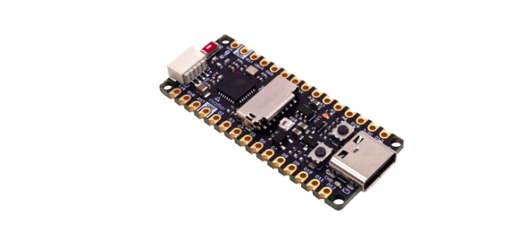
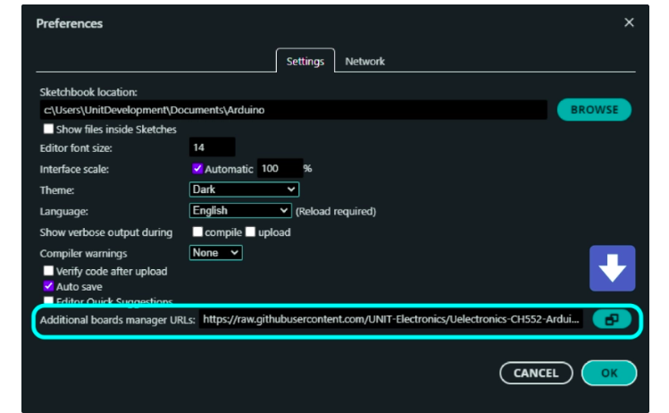
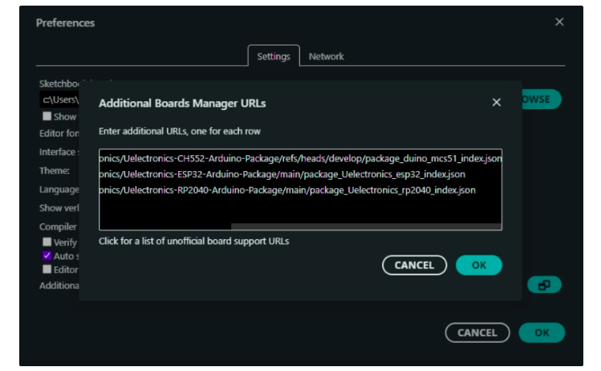
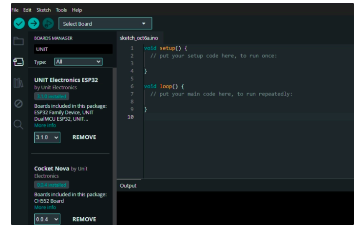
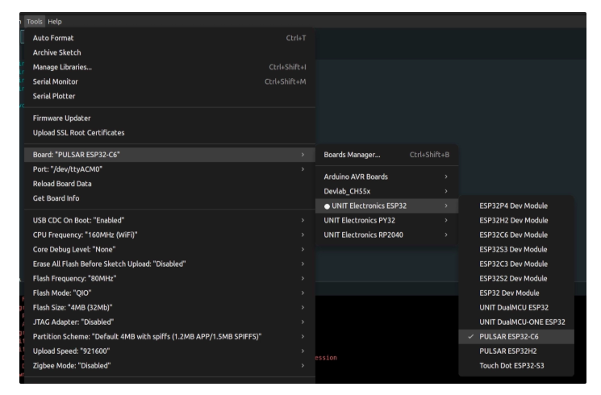
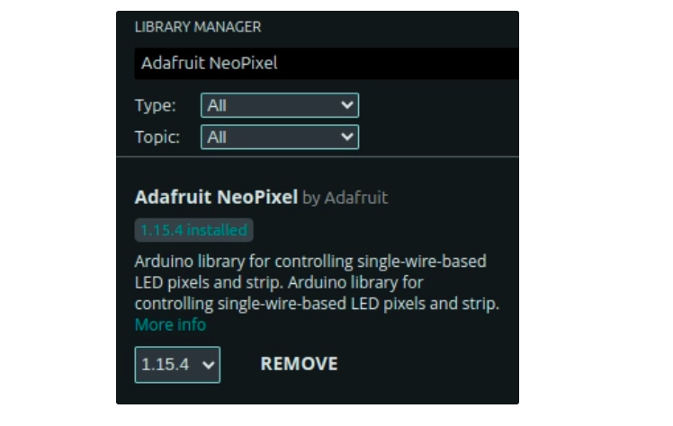

# Software Examples

This directory contains example code and templates for various software modules. These examples demonstrate how to use the provided APIs, integrate with different components, and implement common functionalities within the software space.

## Contents

- Sample usage of core modules
- Integration patterns
- Best practices for module interaction

# Quick Start with Arduino IDE

In this section, we will learn how to configure Arduino IDE to use the **UNIT Pulsar C6** development board, which is based on the **ESP32** microcontroller.

<div align="center">
  
  
</div>

---

## Library Installation

Open the menu **File > Preferences**, or press the keyboard shortcut **Ctrl + comma**.

In **Additional Boards Manager URLs**, copy and paste the following link:

```text
https://raw.githubusercontent.com/UNIT-Electronics/Uelectronics-ESP32-Arduino-Package/main/package_Uelectronics_esp32_index.json
```

<div align="center">
  
  
</div>

Once the URL has been added, press **OK** until all windows are closed.

<div align="center">
  
  
</div>

---

## Development Board Installation

Open the **Boards Manager** menu and search for **UNIT Electronics**. Then install the **ESP32** package.

<div align="center">
  
  
</div>

To select your development board, open the following menu:

```text
Tools > Board > UNIT Electronics ESP32
```

Then select:

```text
PULSAR ESP32-C6
```

<div align="center">
  
  
</div>

---

## Test for the UNIT Pulsar C6

We will test the board using a simple program designed to control the **WS2812 RGB LED**.

To complete this test successfully, the **Adafruit NeoPixel** library must be installed.

Press the keyboard shortcut:

```text
Ctrl + Shift + I
```

Then search for:

```text
Adafruit NeoPixel
```

Install the library.

<div align="center">
  
  
</div>

---

## Example Code

Copy and paste the following code:

```cpp
#include <Adafruit_NeoPixel.h>

#define PIN 8

Adafruit_NeoPixel strip = Adafruit_NeoPixel(1, PIN, NEO_GRB + NEO_KHZ800);

void setup() {
  strip.begin();
  strip.setPixelColor(0, 133, 180, 199); // Set the LED to blue at full brightness
  strip.show();
}

void loop() {
  // Add your main code here, to run repeatedly
}
```

This code initializes the integrated **WS2812 RGB LED** and sets it to a blue color.

The line:

```cpp
#define PIN 8
```

indicates that the integrated NeoPixel is connected to **GPIO8** on the UNIT Pulsar C6 board.

The following line creates the NeoPixel object:

```cpp
Adafruit_NeoPixel strip = Adafruit_NeoPixel(1, PIN, NEO_GRB + NEO_KHZ800);
```

Where:

| Parameter | Description |
|---|---|
| `1` | Number of NeoPixel LEDs being controlled |
| `PIN` | GPIO pin connected to the NeoPixel |
| `NEO_GRB` | Color order used by the LED |
| `NEO_KHZ800` | Communication frequency used by the WS2812 LED |

Inside `setup()`, the LED strip is initialized:

```cpp
strip.begin();
```

Then the LED color is configured:

```cpp
strip.setPixelColor(0, 133, 180, 199);
```

The first value, `0`, represents the LED index. Since only one LED is being controlled, its position is `0`.

The next three values represent the RGB color components:

| Value | Color component |
|---:|---|
| `133` | Red |
| `180` | Green |
| `199` | Blue |

Finally, the color is applied using:

```cpp
strip.show();
```

---

## Pinout

It is important to know the pin distribution of the **UNIT Pulsar C6** development board. For example, in the previous code, **GPIO8** is assigned to the integrated **NeoPixel** LED on the board.

You can check the official pinout here:

[Pinout](https://uelectronics.com/wp-content/uploads/2025/05/PULSAR-ESP32-C6-Pinout.pdf)


---

## Conclusion

The Arduino IDE configuration process for the **UNIT Pulsar C6** consists of adding the corresponding board manager URL, installing the **UNIT Electronics ESP32** package, and selecting the correct board from the **Tools** menu.

Once the board is configured, it is useful to run a basic test program to verify that the development environment is working correctly. In this case, the integrated **WS2812 RGB LED** is controlled using the **Adafruit NeoPixel** library.

This first test confirms that the board, Arduino IDE, installed libraries, and upload configuration are working properly. From this point, the UNIT Pulsar C6 can be used to develop more advanced projects involving sensors, communication modules, actuators, and embedded systems based on the ESP32 platform.